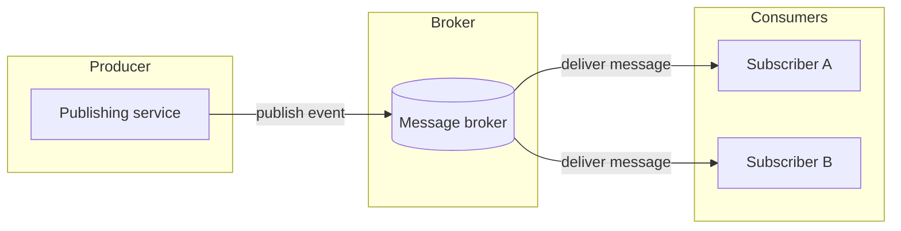
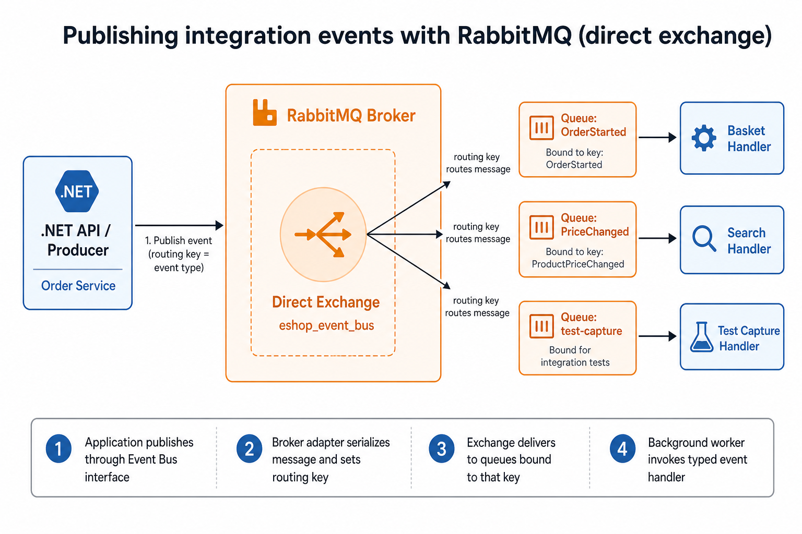
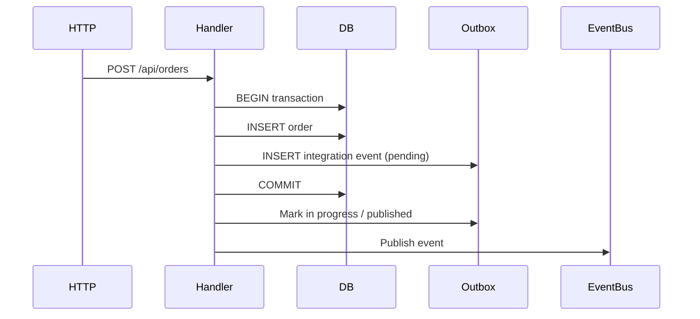

# Post 5 Draft — Building API Integration Tests in .NET: Messaging, Outbox, and RabbitMQ on the Fidelity Ladder

> **Status:** Draft for NashTech Blog  
> **Series:** Post 5 of 5  
> **Demo project:** [trainer1234/eShop-test](https://github.com/trainer1234/eShop-test) (sample app with pluggable test modes)  
> **Related:** `docs/post-4-aspire.md`, `docs/post-1-fidelity-ladder.md`, `docs/code-snippets-per-post.md`, `docs/multi-mode-functional-testing.md`

---

## Metadata (for publication)

**Suggested title:** Building API Integration Tests in .NET — Messaging, Outbox, and RabbitMQ on the Fidelity Ladder

**Subtitle (optional):** Spy bus vs real RabbitMQ — two ways to assert integration events

**Tags:** Application Engineering, Quality Solutions, .NET, Integration Testing, RabbitMQ, Transactional Outbox, Aspire

**Author:** Minh Kha Giai

**Estimated read time:** 18 — 1 minutes

---

## Table of Contents

1. [Introduction](#1-introduction)
2. [A quick review — earlier rungs on the ladder](#2-a-quick-review--earlier-rungs-on-the-ladder)
3. [Message queue architecture — a short primer](#3-message-queue-architecture--a-short-primer)
4. [Publishing events with RabbitMQ](#4-publishing-events-with-rabbitmq)
5. [The transactional outbox pattern](#5-the-transactional-outbox-pattern)
6. [Why test messaging at all?](#6-why-test-messaging-at-all)
7. [Why messaging tests are different from API-only tests](#7-why-messaging-tests-are-different-from-api-only-tests)
8. [Two messaging modes on the Aspire rung](#8-two-messaging-modes-on-the-aspire-rung)
9. [In Action: messaging tests on the demo app](#9-in-action-messaging-tests-on-the-demo-app)
10. [Running, traits, and when to use which mode](#10-running-traits-and-when-to-use-which-mode)
11. [Conclusion](#11-conclusion)
12. [References](#12-references)

---

## 1. Introduction

[The Aspire article](post-4-aspire.md) climbed the ladder with **Aspire orchestration** — databases, optional sibling services, health waits, and the same in-process HTTP tests as lower rungs.

That answers questions about **persistence and cross-service wiring**. It does not fully answer questions about **what leaves the service after a successful HTTP call**.

In a typical microservice API, a state change does not end at the response body. The service also **announces** what happened — a price change, an order submitted, a payment failed — so other services can react without chaining synchronous calls. Those announcements travel as **integration events** through a message broker. If the wrong event fires, or none fires, staging breaks even when the HTTP response is successful. The [earlier articles in this series](post-1-fidelity-ladder.md) — from [repository mock](post-2-mock-and-inmemory.md) through [Testcontainers](post-3-testcontainers.md) to Aspire — rarely catch that class of bug because they stop at status codes and database rows.

This article adds **messaging fidelity** on top of the Aspire rung:

| Layer | What you verify |
|-------|-----------------|
| **HTTP** | Status code and response body (same as earlier rungs) |
| **Outbox** | Integration events persisted in the same DB transaction as business data |
| **Bus** | Events actually published — via an in-process spy or a real RabbitMQ broker |

The post moves from **concepts** (queues, RabbitMQ, transactional outbox) to **test shape** (what differs from API-only tests) to **implementation** (two Aspire modes, assertions, runsettings). The [demo project](https://github.com/trainer1234/eShop-test) supplies working fixtures; the ideas apply to any broker-backed API that uses an outbox.

**Prerequisites:** Docker running (Aspire provisions Postgres and, in one mode, RabbitMQ). Familiarity with the [Aspire hybrid host](post-4-aspire.md) is helpful.

---

## 2. A quick review — earlier rungs on the ladder

The [series introduction](post-1-fidelity-ladder.md) established the **fidelity ladder** — same API tests with swappable dependency realism. [Mock and InMemory](post-2-mock-and-inmemory.md), [Testcontainers](post-3-testcontainers.md), and [Aspire](post-4-aspire.md) each climbed one rung. This article extends the top of that ladder with messaging.

| Concept | Summary |
|---------|---------|
| **Fidelity ladder** | Same API tests; fixture wiring swaps how realistic dependencies are |
| **In-process test host** | Hosts the API inside the test process; dependency injection is the seam for test doubles |
| **Aspire hybrid** | Aspire starts containers; the test host runs the API under test |
| **Messaging is orthogonal** | You can record published events without a real broker — but outbox tests need a real database |

Earlier articles focus on **request → handler → database → HTTP response**. This one extends assertions to **side effects that happen after the transaction commits** — integration events written to an outbox table and published to the message bus.

Sections 3–5 build the messaging vocabulary and the outbox pattern that the test sections assume. If you already know queues and transactional outbox, skim to [Section 6](#6-why-test-messaging-at-all).

---

## 3. Message queue architecture — a short primer

This section establishes the vocabulary used throughout the post — producer, consumer, and why teams accept eventual consistency rather than chaining synchronous HTTP calls inside a single request.

### What problem do queues solve?

In a monolith, Service A calls Service B with an HTTP request. Both succeed or both fail in one process. In microservices, **Service A must not block on Service B** being up, fast, or even deployed. You need **asynchronous, loosely coupled communication**.

A **message queue** (or **message broker**) sits between producers and consumers:



| Idea | What it means |
|------|---------------|
| **Producer** | A service that publishes a message when something happened ("price changed") |
| **Consumer** | A service that subscribes and reacts ("update cart line price") |
| **Decoupling** | Producer does not know consumer implementation; only the message contract |
| **Async** | HTTP returns before every downstream handler finishes |
| **Eventual consistency** | System state converges over time; not everything is atomic across services |
| **Dead letter** | A message moved to a separate queue after repeated processing failures — held for inspection rather than retried forever |

### Publish/subscribe in practice

Brokers differ in topology. Many stacks use **RabbitMQ** with a **direct exchange**: each message type gets a **routing key**, and each consumer binds a **queue** to the keys it cares about.

That is **pub/sub at the application level**: one publish can fan out to multiple subscribers, each with its own queue.

### Why not "just call HTTP"?

A message broker adds **infrastructure to run**, **operational complexity** (retries, dead letters, monitoring), and **eventual consistency** to reason about. The benefit is looser coupling between services — but only when that trade-off is worth the cost. Teams might ask why a request handler cannot simply **call the next service over HTTP** before returning to the client. The table below compares the two approaches: the abstract trade-off, a concrete scenario, and the customer impact.

| Concern | HTTP call from handler | Message via broker | In practice | Consequence |
|---------|------------------------|--------------------|-------------|-------------|
| **Availability** | Couples availability — caller fails or waits if callee is down | Producer can finish once the broker accepts the message | A price update must reach the cart service so totals stay correct | **HTTP:** checkout errors or stale cart prices while the cart service is down. **Messaging:** checkout keeps working; totals refresh when the cart service consumes the event |
| **Retries** | Retries pollute the caller — slow or failed HTTP loops extend the original request | Broker and consumer own retry and dead-letter policies | Placing an order must eventually trigger payment capture | **HTTP:** spinning checkout or timeout while payment errors are retried inline. **Messaging:** fast confirmation; payment finishes moments later in the background |
| **Extensibility** | Harder to add new reactors — each new downstream means new code in the producer | New subscriber binds to an event without changing the publisher | A search indexer should react to catalog changes without risky edits to the publisher | **HTTP:** slower, riskier releases for customer-facing features. **Messaging:** search and recommendations improve without blocking unrelated fixes |
| **Transactions** | Cannot atomically commit your DB write and an outbound HTTP call | Fire-and-forget publish is also unsafe without an outbox | Checkout must not confirm an order unless downstream services will see the same facts | **HTTP:** "order placed" with no charge, or charged with no order. **Messaging:** confirmation matches what downstream services process |

The last row — **transactions** — is the hinge for integration testing. A successful HTTP response is not proof that downstream services will see the change. [Section 5](#5-the-transactional-outbox-pattern) explains the standard pattern for closing that gap. [Section 4](#4-publishing-events-with-rabbitmq) maps the broker side to the moving parts you will assert in tests.

---

## 4. Publishing events with RabbitMQ

The primer above is broker-agnostic. In practice, many .NET microservice applications — including our demo — hide the broker behind an **event bus** abstraction so domain code publishes events without knowing RabbitMQ details.

The diagram below is the mental model for the rest of this post. Read it left to right: the API publishes an event; the broker routes it; queues and handlers receive only the message types they subscribed to.



**Follow the numbered path:**

| Step | What happens |
|------|----------------|
| **① Publish** | Application code calls the event bus ("an order was submitted") |
| **② Route** | The broker adapter serializes the message and sets a **routing key** — usually the event type name |
| **③ Exchange** | A **direct exchange** forwards the message only to queues **bound** to that routing key |
| **④ Consume** | A background worker pulls from each queue and invokes the matching **typed handler** |

In the demo, one exchange (`eshop_event_bus`) fans out to many queues. Basket might bind to `OrderStarted`; a search service might bind to `ProductPriceChanged`; a test might bind to the same keys through a **capture handler** — without starting every downstream microservice.

**The four moving parts in code:**

| Piece | Typical role |
|-------|--------------|
| **Event bus interface** | Application code publishes integration events through one contract |
| **Broker adapter** | Opens connections, declares exchanges, serializes and routes messages |
| **Event handlers** | One handler per message type on the consumer side |
| **Background workers** | Pull messages from the broker and dispatch to handlers |

The broker adapter in the demo is only a few lines at the publish point:

```csharp
// Broker adapter — routing key is the event type name
var routingKey = @event.GetType().Name;
await channel.ExchangeDeclareAsync(exchange: "eshop_event_bus", type: "direct");
await channel.BasicPublishAsync(exchange: ExchangeName, routingKey: routingKey, ...);
```

Exchange names and routing conventions are application-specific. The **test questions** are universal: was the right message published, with the right payload, through the real adapter?

**In tests**, RabbitMQ appears only in the higher-fidelity messaging mode. The fixture asks Aspire to start a broker container alongside Postgres — the same wiring path as production, scoped to the test host.

**What RabbitMQ tests add over a spy bus:** serialization to bytes, exchange declaration, routing keys, subscription wiring, and the background worker pipeline that delivers messages back to handlers (steps ②–④ in the diagram).

Production still has a coordination gap between the database and the broker. [Section 5](#5-the-transactional-outbox-pattern) explains the pattern used to close it.

---

## 5. The transactional outbox pattern

[Section 4](#4-publishing-events-with-rabbitmq) showed how events leave the service and reach subscribers. That pipeline assumes the message should exist. It does not guarantee the message is **consistent with the database** — the harder problem in distributed systems.

### The problems without an outbox

| Problem | What goes wrong |
|---------|-----------------|
| **Dual-write** | Saving business data and publishing to the broker are **two separate writes** to two different systems. They cannot share a single atomic transaction. |
| **Publish before commit** | The broker receives an event, then the database transaction rolls back. Downstream services react to something that never became true — a **ghost event**. |
| **Commit before publish** | The database commits, but the broker publish fails. Downstream never learns of a change customers already see — a **lost event**. |
| **Fire-and-forget publish** | Publishing directly after commit without recording intent still loses messages on process crash between commit and publish — no **durable record** to retry from. |

Section 3's transactions row showed the customer impact: "order placed" with no charge, or charged with no order. The root cause is always the same — **two systems updated without a single source of truth**.

For a fuller walkthrough of the dual-write problem and why the outbox exists, see James Carr's article [The Transactional Outbox Pattern](https://james-carr.org/posts/2026-01-15-transactional-outbox-pattern/).

### The pattern

**Transactional outbox:** write the event to an **outbox table in the same DB transaction** as the business update. After commit, a worker (or the same request scope) reads pending rows, publishes to the bus, then marks rows as published. The database becomes the **system of record**; the broker is fed from that record.



A typical implementation splits the work into **save to outbox inside the transaction** and **publish after commit**. The demo's ordering service follows that shape:

```csharp
// Save inside the DB transaction
public async Task AddAndSaveEventAsync(IntegrationEvent evt)
{
    await _eventLogService.SaveEventAsync(evt, _orderingContext.GetCurrentTransaction());
}

// Publish after commit
public async Task PublishEventsThroughEventBusAsync(Guid transactionId)
{
    var pendingLogEvents = await _eventLogService.RetrieveEventLogsPendingToPublishAsync(transactionId);
    foreach (var logEvt in pendingLogEvents)
    {
        await _eventLogService.MarkEventAsInProgressAsync(logEvt.EventId);
        await _eventBus.PublishAsync(logEvt.IntegrationEvent);
        await _eventLogService.MarkEventAsPublishedAsync(logEvt.EventId);
    }
}
```

**What tests should verify:**

1. Correct event types appear in the outbox with a published state.
2. Published payloads match the business operation (identifiers, amounts, status fields).
3. (RabbitMQ mode) Messages survive serialization and reach a subscriber.

With the production path defined, we can ask what fails in practice — and how that failure differs from the API-only tests covered from [mock and InMemory](post-2-mock-and-inmemory.md) through [Aspire](post-4-aspire.md).

---

## 6. Why test messaging at all?

Unit tests can assert that application code *attempts* to publish an event. That proves **intent**, not **end-to-end behavior** through the outbox and broker pipeline described above.

| Risk | What breaks without messaging tests |
|------|--------------------------------------|
| **Wrong payload** | Event published with stale price, wrong id, or missing field |
| **Wrong event type** | Handler emits a cancellation event instead of a creation event |
| **Outbox not written** | DB commit succeeds but no outbox row — downstream never sees the change |
| **Outbox not published** | Row stuck in a pending state — broker never receives the message |
| **Serialization / routing** | Payload shape or routing key mismatch — consumers silently ignore messages |
| **Subscription gaps** | Handler exists but is never registered — messages arrive nowhere useful |

Testing only HTTP catches none of the risks in the table. You need assertions on **persisted events** and **published events** — which changes the shape of the test itself.

**When messaging tests earn their keep:**

- Commands that **must** emit specific integration events
- Refactors to the event bus, outbox services, or message contracts
- CI gates before release or before merging event schema changes
- Regression after fixing bugs like "green API test, broken staging event"

The risks are about *correctness*. The next section is about *test mechanics* — why the comfortable API-only rhythm from earlier articles is not enough.

---

## 7. Why messaging tests are different from API-only tests

The [mock-through-Aspire articles](post-2-mock-and-inmemory.md) teach a rhythm: **arrange → HTTP call → assert status/body → optional database read**. Messaging keeps that HTTP step and adds **outbox and bus assertions** with different timing and fixture wiring.

### 7.1 Side effects are asynchronous

After the database commit, publishing may still run in the same request — but with a real broker, the test process is also a **subscriber** waiting for messages to arrive. Assertions often need a **timeout and poll loop**, not an immediate read after a successful HTTP response.

### 7.2 Two surfaces to assert

Section 5 listed three things to verify; in code there are two read paths:

| Surface | What it proves |
|---------|----------------|
| **Outbox table** (rows marked published) | Event was recorded atomically with business data and marked published |
| **Bus capture** | The event bus received the message (spy) or a subscriber consumed it (RabbitMQ) |

Either surface can pass in isolation while the other is broken. The demo asserts **both** for a stronger signal.

### 7.3 Infrastructure stripping in spy mode

The real broker adapter usually runs as a **background service**. If you swap in a spy bus but leave broker background services registered, the host still tries to connect to RabbitMQ.

Spy mode therefore **removes the broker adapter and background services**, then registers an in-memory recorder:

```csharp
private static void RemoveRabbitMqInfrastructure(IServiceCollection services)
{
    services.RemoveAll<IEventBus>();
    foreach (var descriptor in services.Where(d => d.ServiceType == typeof(IHostedService)).ToList())
        services.Remove(descriptor);
}
```

### 7.4 RabbitMQ mode needs capture handlers

With a real broker, the API under test is both **publisher and subscriber** (same as local development). Tests register lightweight handlers for each event type so the test process **records consumed messages** without starting every downstream microservice.

### 7.5 Still on the Aspire rung for persistence

Outbox rows live in **PostgreSQL**. Messaging modes are **not** a return to an in-memory database — they extend Aspire with an optional RabbitMQ container:

```
AspireMessagingOutbox   → Postgres (Aspire) + spy event bus
AspireMessagingRabbitMq → Postgres (Aspire) + RabbitMQ (Aspire) + capture handlers
```

### 7.6 Comparison: API-only vs messaging integration tests

| Aspect | API-only tests (mock → InMemory → Testcontainers → Aspire) | Messaging tests (this article) |
|--------|-------------------------------------------------------------|--------------------------------|
| Primary assertion | HTTP + optional DB row | HTTP + outbox rows + events |
| Timing | Mostly synchronous | May wait on broker delivery |
| Fixture changes | Repository, database, external stubs | Above + bus swap or capture subscriptions |
| Docker | From Testcontainers or Aspire | Aspire (Postgres; + RabbitMQ in one mode) |
| Flake sources | Container startup | Container startup + message latency |

The next section wires two messaging modes on the [Aspire hybrid fixture](post-4-aspire.md).

---

## 8. Two messaging modes on the Aspire rung

The [Aspire article](post-4-aspire.md) established the hybrid host: Aspire provisions dependencies; the test host runs the API. This article adds a **mode switch** on that same fixture — whether a real broker starts, and how published events are recorded in tests.

| Mode | RabbitMQ container | Event bus in tests | How events are captured |
|------|-------------------|--------------------|-------------------------|
| **`AspireMessagingOutbox`** | No | In-memory spy | Events recorded on the spy |
| **`AspireMessagingRabbitMq`** | Yes | Production broker adapter | Test-side capture handlers |

### Spy bus mode — fast, focused on outbox + publish call

Section 7 noted that spy mode must strip broker background services. Registration in the demo looks like this:

```csharp
public static void ConfigureOutboxWithSpyBus(IServiceCollection services)
{
    RemoveRabbitMqInfrastructure(services);
    services.AddSingleton<CapturingEventBus>();
    services.AddSingleton<IEventBus>(sp => sp.GetRequiredService<CapturingEventBus>());
    // ... other test doubles for non-messaging dependencies
}
```

The spy implements the same event bus interface and records every publish call:

```csharp
public sealed class CapturingEventBus : IEventBus
{
    private readonly ConcurrentQueue<IntegrationEvent> _published = new();
    public IReadOnlyCollection<IntegrationEvent> Published => _published.ToArray();

    public Task PublishAsync(IntegrationEvent @event)
    {
        _published.Enqueue(@event);
        return Task.CompletedTask;
    }
}
```

**Best for:** verifying correct events and payloads without broker startup cost; PR pipelines that already run Aspire database tests.

### RabbitMQ mode — broker fidelity

Here the production broker adapter stays in place. Tests add capture handlers so the test process subscribes to its own events:

```csharp
public static void ConfigureRabbitMqWithCaptureHandlers(IServiceCollection services)
{
    IntegrationEventCapture.Reset();
    services.AddCaptureSubscription<ProductPriceChangedIntegrationEvent>();
    // Demo: ordering tests register multiple event types
}
```

Capture handlers collect delivered messages; tests wait until the expected count arrives:

```csharp
await IntegrationEventCapture.WaitForCountAsync(expectedCount, TimeSpan.FromSeconds(30), cancellationToken);
```

**Best for:** pre-release or nightly runs where serialization, routing, and subscription wiring must match production.

### Shared outbox assertions

Both modes query the outbox the same way — the first assertion surface from Section 7:

```csharp
var outboxEvents = await OutboxAssertions.GetPublishedEventsAsync<CatalogContext>(
    host.Fixture.Services,
    cancellationToken,
    nameof(ProductPriceChangedIntegrationEvent));

Assert.Single(outboxEvents);
```

### Fixture wiring (unchanged hybrid shape)

The demo's test fixtures branch on mode from the [Aspire article](post-4-aspire.md). Messaging modes reuse the Aspire host and start RabbitMQ only in the broker fidelity mode:

```csharp
_aspireHost = new CatalogAspireTestHost(testAssembly,
    includeRabbitMq: _mode == CatalogFunctionalTestMode.AspireMessagingRabbitMq);

var endpoints = await _aspireHost.StartAsync(
    waitForEventBus: _mode == CatalogFunctionalTestMode.AspireMessagingRabbitMq);
```

Section 9 applies these modes to two representative scenarios from the demo — a single-event update and a multi-event command.

---

## 9. In Action: messaging tests on the demo app

The examples below illustrate the patterns from Sections 7–9. They use the demo's catalog and ordering APIs, but the structure — HTTP call, outbox assertion, bus assertion — transfers to any service that uses an outbox.

The tests follow the same shape in both modes: HTTP arrange, outbox check, then bus check (spy or capture handler). Only the RabbitMQ variants wait for asynchronous delivery.

### Example 1 — single event after a data update

When a catalog item price changes, the demo expects one integration event. **Spy bus test:** update via HTTP, then assert outbox and spy.

```csharp
[Fact]
[CatalogFunctionalTestMode(CatalogFunctionalTestMode.AspireMessagingOutbox)]
public async Task UpdateCatalogItem_PublishesPriceChangedEventToOutboxAndSpyBus()
{
    var host = await _session.CreateHostAsync(GetType(), nameof(UpdateCatalogItem_PublishesPriceChangedEventToOutboxAndSpyBus), handler);
    var capturingBus = host.Fixture.Services.GetRequiredService<CapturingEventBus>();
    capturingBus.Reset();

    var itemToUpdate = await GetCatalogItemAsync(host, 1);
    var originalPrice = itemToUpdate.Price;
    itemToUpdate.Price = originalPrice + 1.5m;

    var response = await host.Client.PutAsJsonAsync("/api/catalog/items", itemToUpdate, cancellationToken);
    response.EnsureSuccessStatusCode();

    var outboxEvents = await OutboxAssertions.GetPublishedEventsAsync<CatalogContext>(
        host.Fixture.Services, cancellationToken,
        nameof(ProductPriceChangedIntegrationEvent));

    Assert.Single(outboxEvents);
    Assert.Contains(capturingBus.Published, @event => @event is ProductPriceChangedIntegrationEvent priceChanged
        && priceChanged.ProductId == itemToUpdate.Id
        && priceChanged.NewPrice == itemToUpdate.Price
        && priceChanged.OldPrice == originalPrice);
}
```

**RabbitMQ variant:** same HTTP arrange; wait for one captured message; assert outbox and capture list.

### Example 2 — multiple events in one transaction

Creating an order emits **two** integration events in one database transaction — a stronger check that the outbox handles multiple rows per commit.

```csharp
[Fact]
[OrderingFunctionalTestMode(OrderingFunctionalTestMode.AspireMessagingOutbox)]
public async Task AddNewOrder_PublishesIntegrationEventsToOutboxAndSpyBus()
{
    var host = await _session.CreateHostAsync(GetType(), nameof(AddNewOrder_PublishesIntegrationEventsToOutboxAndSpyBus));
    var capturingBus = host.Fixture.Services.GetRequiredService<CapturingEventBus>();
    capturingBus.Reset();

    var response = await host.Client.PostAsync("api/orders", CreateOrderContent(), cancellationToken);
    response.EnsureSuccessStatusCode();

    var outboxEvents = await OutboxAssertions.GetPublishedEventsAsync<OrderingContext>(
        host.Fixture.Services, cancellationToken,
        nameof(OrderStartedIntegrationEvent),
        nameof(OrderStatusChangedToSubmittedIntegrationEvent));

    Assert.Equal(2, outboxEvents.Count);
    Assert.Contains(capturingBus.Published, @event => @event is OrderStartedIntegrationEvent started && started.UserId == "1");
    Assert.Contains(capturingBus.Published, @event => @event is OrderStatusChangedToSubmittedIntegrationEvent submitted && submitted.BuyerIdentityGuid == "1");
}
```

The RabbitMQ variant waits for two captured messages before the same assertions.

### What these tests prove beyond API-only rungs

| Step | Single-event update | Multi-event command |
|------|---------------------|---------------------|
| HTTP pipeline + handler | Yes | Yes |
| Real Postgres + outbox schema | Yes | Yes |
| Correct event types and payloads | Yes | Yes (two events) |
| Event bus publish invoked | Spy mode | Spy + RabbitMQ mode |
| Broker serialization + consume path | RabbitMQ mode only | RabbitMQ mode only |

Compared with [mock through Aspire](post-2-mock-and-inmemory.md), the last three rows are what messaging adds. Switch mode via runsettings or test traits — no changes to the test methods themselves.

---

## 10. Running, traits, and when to use which mode

### Runsettings

```bash
# Spy bus + outbox (no RabbitMQ container)
dotnet test tests/Catalog.FunctionalTests --settings eShop.FunctionalTests.AspireMessagingOutbox.runsettings
dotnet test tests/Ordering.FunctionalTests --settings eShop.FunctionalTests.AspireMessagingOutbox.runsettings

# Real RabbitMQ
dotnet test tests/Catalog.FunctionalTests --settings eShop.FunctionalTests.AspireMessagingRabbitMq.runsettings
dotnet test tests/Ordering.FunctionalTests --settings eShop.FunctionalTests.AspireMessagingRabbitMq.runsettings
```

Runsettings set environment variables that select the messaging mode for each test project.

### xUnit traits (filter in IDE or CI)

| Trait value | Mode |
|-------------|------|
| `aspire-messaging-outbox` | Spy bus + outbox |
| `aspire-messaging-rabbitmq` | Real RabbitMQ + capture handlers |

```bash
dotnet test tests/Catalog.FunctionalTests --filter "FunctionalTestMode=aspire-messaging-outbox"
```

### When to use which mode

| Scenario | Recommended mode |
|----------|------------------|
| Local dev — "did I emit the right event?" | `AspireMessagingOutbox` |
| PR CI — outbox regression without broker cost | `AspireMessagingOutbox` |
| Nightly / pre-release — full messaging stack | `AspireMessagingRabbitMq` |
| Debugging routing / serialization bugs | `AspireMessagingRabbitMq` |

### Pros and cons

| | `AspireMessagingOutbox` | `AspireMessagingRabbitMq` |
|--|-------------------------|-------------------------|
| **Pros** | Faster; no broker flake; still tests outbox + publish path | Exercises real broker adapter and handlers |
| **Cons** | Does not catch broker-specific failures | Slower cold start; timing-sensitive waits |
| **Docker** | Postgres (+ sibling services when required) | Postgres + RabbitMQ (+ siblings when required) |

---

## 11. Conclusion

Messaging is the **side effect behind the HTTP response**. Earlier articles taught you to climb the ladder for databases and orchestration; this one teaches you to assert **what the service announces to the rest of the system**.

- **Message queues** decouple services through async publish/subscribe.
- **RabbitMQ** (behind an event bus abstraction) routes integration events through exchanges and typed handlers.
- **Transactional outbox** keeps database writes and event records consistent.
- **Messaging tests differ** because you assert outbox rows, bus behavior, and sometimes async delivery — not just status codes.
- **Two modes** let you choose fidelity: a spy bus for speed, a real broker for realism — both on the [Aspire hybrid host](post-4-aspire.md).

Across the series, the practical workflow stays the same: use **Mock / InMemory** for the local loop, **Testcontainers** when you need real database semantics, and **Aspire (+ messaging)** when orchestration and broker fidelity matter.

---

## 12. References

**This series**

- [A Test Fidelity Ladder](post-1-fidelity-ladder.md) — series introduction
- [Repository Mock and EF InMemory](post-2-mock-and-inmemory.md) — bottom two rungs
- [Testcontainers on the Fidelity Ladder](post-3-testcontainers.md) — real database in Docker
- [Aspire on the Fidelity Ladder](post-4-aspire.md) — orchestration in tests
- `docs/multi-mode-functional-testing.md` — fixture architecture and mode switching
- `docs/code-snippets-per-post.md` — snippet index (messaging section)

**Demo repo**

- [trainer1234/eShop-test on GitHub](https://github.com/trainer1234/eShop-test)

**Transactional outbox**

- [The Transactional Outbox Pattern](https://james-carr.org/posts/2026-01-15-transactional-outbox-pattern/) — James Carr (dual-write problem and pattern walkthrough)
- [Transactional outbox pattern](https://learn.microsoft.com/en-us/azure/architecture/patterns/transactional-outbox) — Microsoft Azure Architecture Center

**RabbitMQ**

- [RabbitMQ tutorials — publish/subscribe](https://www.rabbitmq.com/tutorials/tutorial-three-dotnet) — exchanges and bindings
- [Aspire RabbitMQ hosting](https://aspire.dev/integrations/rabbitmq/) — `AddRabbitMQ` for local and test orchestration

**Testing**

- [Integration tests in ASP.NET Core](https://learn.microsoft.com/en-us/aspnet/core/test/integration-tests) — in-process test hosts
- [Aspire testing overview](https://aspire.dev/testing/overview/) — resource health and test hosts
